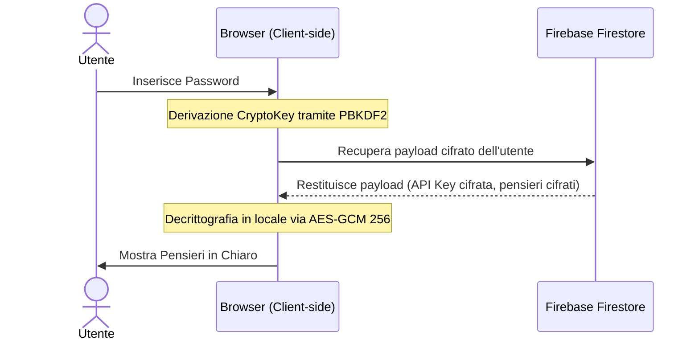

# Architettura di Sicurezza e Crittografia "I Miei Pensieri"

Questo documento descrive in dettaglio l'architettura crittografica, il modello di sicurezza Zero-Knowledge e la struttura dei file del progetto.

---

## 1. Modello di Sicurezza Zero-Knowledge (E2EE)

L'applicazione è progettata per garantire che lo sviluppatore o terzi (compreso Firebase) non possano mai leggere i pensieri dell'utente in chiaro. 



### Flusso Crittografico Dettagliato

1. **Derivazione della Chiave (PBKDF2)**
   - Quando l'utente inserisce la sua **Password Cassaforte**, il browser utilizza le Web Crypto API per derivare una chiave simmetrica forte.
   - Algoritmo: **PBKDF2** (Password-Based Key Derivazione Function 2).
   - Hash: SHA-256.
   - Iterazioni: 600.000.
   - Salt: Derivato in modo univoco dall'ID dell'utente (Firebase Auth UID) per prevenire attacchi tramite tabelle arcobaleno. La master vault key è inoltre crittografata client-side utilizzando una chiave derived da una frase di recupero a 12 parole (Seed Phrase) memorizzata su Firestore, offrendo una via di ripristino interamente decentralizzata e protetta.

2. **Cifratura dei Dati (AES-GCM 256)**
   - Prima di salvare qualsiasi dato su Firestore, questo viene cifrato interamente nel client.
   - Algoritmo: **AES-GCM** (Advanced Encryption Standard in Galois/Counter Mode) con chiave a 256 bit.
   - Ogni operazione di cifratura genera un **IV (Vettore di Inizializzazione)** univoco di 12 byte per garantire che lo stesso testo cifrato non produca mai lo stesso output.
   - Su Firestore vengono salvati unicamente il `ciphertext` (in formato Base64) e il relativo `iv` (in formato Base64).

3. **Gestione API Key di Gemini (Bring Your Own Key - BYOK)**
   - L'utente può salvare la propria API Key di Google AI Studio in modo che sia disponibile su tutti i suoi dispositivi.
   - Per mantenere l'approccio Zero-Knowledge, l'API Key viene cifrata con la `cryptoKey` dell'utente prima di essere salvata in Firestore nel documento del profilo utente.
   - Durante la sessione attiva, l'API Key decifrata viene mantenuta in `localStorage` in formato cifrato per consentire l'accesso immediato alle funzioni IA dopo lo sblocco dell'app.

---

## 2. Integrazione delle API di Intelligenza Artificiale

Le funzionalità di intelligenza artificiale (trascrizione, analisi e consigli) sono eseguite interamente sul client. I pensieri decifrati vengono inviati alle API di Google Gemini tramite richieste HTTPS dirette dal browser, senza intermediari o server di backend che possano registrare i dati.

- **Dettatura e Trascrizione**: Utilizza il microfono del dispositivo e delega la trascrizione a Gemini Flash.
- **Analisi e Profilo**: Gemini elabora i pensieri (solo su richiesta e previo consenso esplicito) per generare un'analisi filosofica e consigli di lettura oppositivi.
- **Privacy e Data Retention**: I consensi e le accettazioni dei ToS (in particolare §3 sulla natura dell'IA e §4 sull'esportazione) sono gestiti localmente.

---

## 3. Mappa dei File del Progetto

```
src/
├── App.tsx                     # Componente radice: routing dei tab, inizializzazione Firebase, flussi principali.
├── main.tsx                    # Entry point di React.
├── index.css                   # Stili globali e design system (curva dei colori, variabili CSS, responsive).
├── types.ts                    # Definizioni dei tipi TypeScript (Thought, ProfileData, User, ecc.).
├── components/
│   ├── ThoughtCard.tsx         # Visualizzazione e modifica (Gemini client-side) di un singolo pensiero. Include accordion "Domande Maieutiche" con generazione socratica on-demand.
│   ├── Profile.tsx             # Analisi Filosofica (nome tutelato), consigli di lettura e import/esportazione Obsidian.
│   ├── SpuntiRiflessione.tsx   # Widget degli spunti giornalieri (limite 4 refresh/giorno).
│   ├── EthicalGatekeeper.tsx   # Controllo di compliance etica con timer da 12 secondi per i feedback.
│   ├── IdeaScreen.tsx          # Schermata del manifesto e dell'idea dell'app (timer di sblocco).
│   ├── Onboarding.tsx          # Flusso di onboarding multilingua passo-passo.
│   ├── PasswordSetup.tsx       # Schermata di impostazione e verifica della Password Cassaforte.
│   ├── ApiKeySetup.tsx         # Configurazione dell'API Key Gemini dell'utente.
│   ├── RecordButton.tsx        # Pulsante di registrazione vocale premium con visualizer.
│   ├── ConnectionIndicator.tsx # Indicatore di stato delle connessioni interne tra pensieri.
│   ├── Stats.tsx               # Statistiche, grafici emotivi e trend.
│   ├── Legal.tsx               # Modale di visualizzazione di ToS e Privacy Policy completi.
│   ├── ShareModal.tsx          # Canvas generator per la condivisione social ad alta risoluzione. Layout 9:16 con QR code (libreria qrcode), link app e data.
│   └── Login.tsx               # Schermata di autenticazione Firebase.
├── contexts/
│   └── LanguageContext.tsx     # Contesto per il supporto multilingua (Italiano/Inglese).
├── hooks/
│   ├── useThoughts.ts          # Hook per caricamento, cifratura e sincronizzazione dei pensieri con Firestore.
│   └── useAudioRecorder.ts     # Hook di registrazione audio con trascrizione Gemini. Fix accumulo SpeechRecognition tramite finalTranscriptRef. Fix salvataggio: transcript resettato a "" prima di Gemini per evitare salvataggio doppio (grezzo+Gemini).
 └── lib/
    ├── crypto.ts               # Funzioni crittografiche core (PBKDF2, AES-GCM encrypt/decrypt).
    ├── firebase.ts             # Inizializzazione e configurazione dell'SDK Firebase client.
    ├── translations.ts         # Dizionario centralizzato per la localizzazione (it/en).
    └── featureFlags.ts         # Definizione centralizzata degli interruttori di funzionalità (Feature Flags).

## Note Architetturali

- **Prompt IA**: App.tsx e ThoughtCard.tsx usano prompt "ghostwriter/analista esistenziale" (temperature 0.5) anziché correzione bozze.
- **Maieutica pre-gen**: App.tsx esegue coda in background (4s/item, 15/min) per pre-generare spunti_maieutici su tutti i pensieri che ne sono privi. Al click l'accordion è già pronto.
- **Analisi Filosofica**: Profile.tsx usa `gemini-2.0-flash` (1M TPM, ideale per prompt lunghi con molti pensieri) mentre le altre chiamate usano `gemini-2.5-flash`.
- **ShareModal**: useEffect dipende da primitive (id, content, title, timestamp) non dall'object reference, per evitare re-generazione del canvas a 60fps durante l'animazione del visualizer.
 └── lib/
    ├── crypto.ts               # Funzioni crittografiche core (PBKDF2, AES-GCM encrypt/decrypt).
    ├── firebase.ts             # Inizializzazione e configurazione dell'SDK Firebase client.
    ├── translations.ts         # Dizionario centralizzato per la localizzazione (it/en).
    └── featureFlags.ts         # Definizione centralizzata degli interruttori di funzionalità (Feature Flags).
per-me/
├── toggle.js                   # Script Node per attivare/disattivare i moduli da terminale.
└── README.md                   # Documentazione d'uso del Centro di Comando.
public/
└── admin/
    ├── index.html              # Entry point HTML del Centro di Comando esterno.
    ├── style.css               # Stili CSS Vanilla per l'interfaccia dell'admin.
    └── app.js                  # Logica client-side (autenticazione admin, feature flags, metriche).
```
